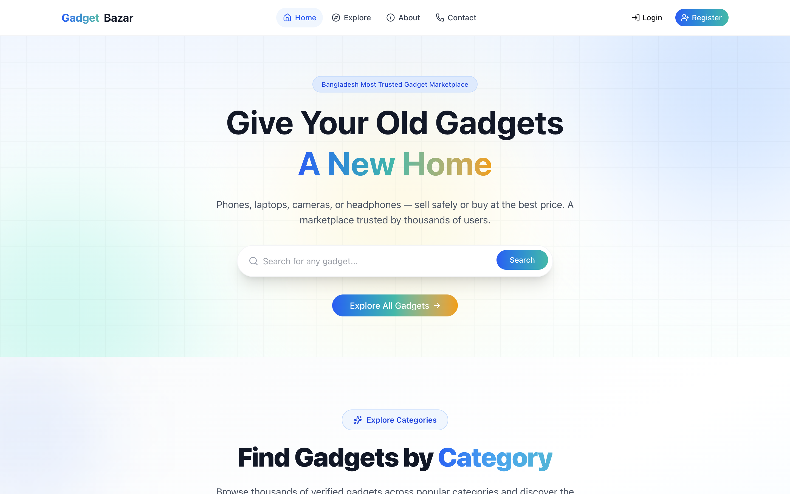
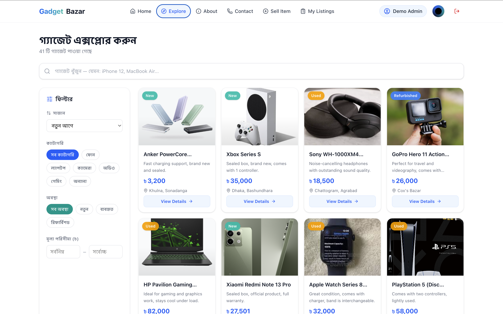
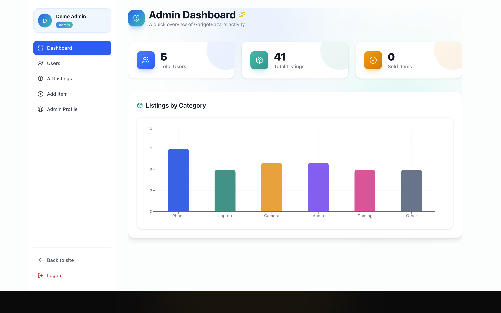

cat > README.md << 'EOF'
<div align="center">

# 📱 GadgetBazar

### Bangladesh's Trusted Marketplace for Buying & Selling Second-Hand Gadgets

[](https://nextjs.org/)
[](https://www.typescriptlang.org/)
[](https://www.mongodb.com/)
[](https://tailwindcss.com/)

🔗 [**Live Demo**](https://gadgetbazar-swart.vercel.app/) &nbsp;|&nbsp; 📦 [**GitHub Repo**](https://github.com/azizul-dev/gadgetbazar)

</div>

---

## ✨ Overview

**GadgetBazar** is a full-stack, production-ready marketplace where users can buy and sell second-hand electronics — phones, laptops, cameras, audio gear, and gaming devices. Built with a modern TypeScript stack, it features secure authentication, role-based authorization, a review & rating system, and a polished, fully responsive UI.

---

## 📸 Screenshots

<table>
  <tr>
    <td align="center"><b>🏠 Home / Hero Section</b></td>
  </tr>
  <tr>
    <td></td>
  </tr>
  <tr>
    <td align="center"><b>🔍 Explore / Listing Page</b></td>
  </tr>
  <tr>
    <td></td>
  </tr>
  <tr>
    <td align="center"><b>🛠️ Admin Dashboard</b></td>
  </tr>
  <tr>
    <td></td>
  </tr>
</table>

---

## 🚀 Features

### 🏠 Landing Page
- Sticky, fully responsive navbar with dynamic route count (logged in / out)
- Interactive hero section with live search
- 7+ meaningful sections — Categories, Featured Gadgets, How It Works, Testimonials, FAQ, Newsletter
- Fully functional footer with contact info & social links

### 🛍️ Marketplace
- Responsive gadget listing cards with image, title, description, price, and condition
- Skeleton loaders for smooth loading states
- Search, multi-field filtering (category, condition, price range), sorting & pagination
- Detailed product page with image gallery, seller info, and related items

### ⭐ Reviews & Ratings
- Authenticated users can rate (1–5 stars) and review any listing
- Average rating & review count calculated live
- Users can edit or delete their own review

### 🔐 Authentication & Authorization
- JWT-based auth with secure HTTP-only cookies
- Demo login buttons (auto-fill credentials) for quick testing
- Route protection via middleware — guests are redirected to `/login`
- Role-based access control (`user` / `admin`)

### 📦 Protected Dashboards
- **Add Item** (`/items/add`) — create a new listing
- **Manage Items** (`/items/manage`) — view, edit, and delete your own listings
- **Admin Panel** (`/admin`) — manage all users and listings platform-wide

---

## 🧰 Tech Stack

| Layer | Technology |
|---|---|
| **Frontend** | Next.js 16 (App Router), React 19, TypeScript |
| **Styling** | Tailwind CSS, Framer Motion, HeroUI |
| **Forms & Validation** | React Hook Form, Zod |
| **Backend** | Next.js API Routes |
| **Database** | MongoDB with Mongoose |
| **Authentication** | JWT (jose + jsonwebtoken), bcryptjs |
| **Charts** | Recharts |
| **Icons** | Lucide React |

---

## 🔑 Demo Credentials

| Role | Email | Password |
|---|---|---|
| 👤 User | `demouser@gadgetbazar.com` | `demo1234` |
| 🛡️ Admin | `demoadmin@gadgetbazar.com` | `demo1234` |

> Or just hit **"Try Demo User"** / **"Try Demo Admin"** on the login page — credentials auto-fill and log you in instantly.

---

## ⚙️ Getting Started

### Prerequisites
- Node.js 18+
- A MongoDB connection string (local or [MongoDB Atlas](https://www.mongodb.com/atlas))

### Installation

```bash
# Clone the repository
git clone https://github.com/azizul-dev/gadgetbazar.git
cd gadgetbazar

# Install dependencies
npm install

# Set up environment variables
cp .env.example .env.local
```

Fill in `.env.local`:

```env
MONGODB_URI=your_mongodb_connection_string
JWT_SECRET=your_jwt_secret
```

### Run the development server

```bash
npm run dev
```

Open [http://localhost:3000](http://localhost:3000) in your browser. 🎉

### Seed demo data (optional)

```bash
node scripts/seed.js
```

---

## 📁 Project Structure

gadgetbazar/
├── src/
│   ├── app/              # Pages & API routes (App Router)
│   │   ├── api/          # Backend REST endpoints
│   │   ├── admin/        # Admin dashboard
│   │   ├── gadgets/      # Listing & details pages
│   │   ├── items/        # Add / edit / manage listings
│   │   └── ...           # Auth, about, contact, etc.
│   ├── components/       # Reusable UI components
│   ├── context/          # Auth context
│   ├── lib/               # DB connection, auth helpers
│   ├── models/            # Mongoose schemas
│   └── middleware.ts       # Route protection
└── public/                # Static assets & images

---

## 🌐 Deployment

This project is deployed on **[Vercel](https://vercel.com/)**.  
🔗 **Live URL:** [https://gadgetbazar-swart.vercel.app/](https://gadgetbazar-swart.vercel.app/)

---

<div align="center">

Made with ❤️ by **[Md Azizul Islam](https://github.com/azizul-dev/gadgetbazar)**

</div>
EOF